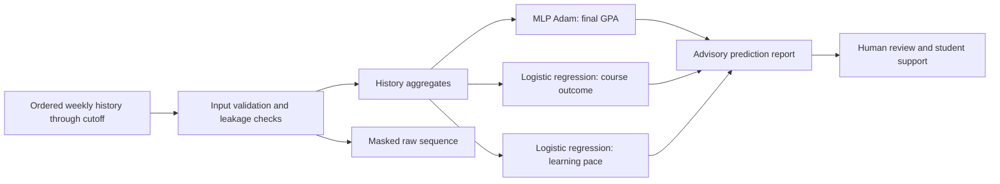

# SRG Tracker - Student Ranking & GPA Tracker

**Student:** IBRAGIMOV ANVAR
**Selected project track:** SRG Tracker - Student Ranking & GPA Tracker
**Version:** V2.3 (reproducible research prototype)

> Scope note: despite the track title, this version does **not** rank students. It is an advisory early-warning research prototype that predicts academic signals from a student's own course history.

## 1. Problem statement

Students and instructors need an early, reproducible indication of academic progress before a course ends. SRG Tracker processes the complete ordered weekly history available through a submitted cutoff and estimates three signals: final GPA, risk of a repeat-required outcome, and learning pace. The outputs are intended to support discussion and timely help, never automatic academic decisions.

## 2. Selected project track

**SRG Tracker - Student Ranking & GPA Tracker.** The implemented V2.3 scope is GPA tracking and early warning; individual ranking is explicitly out of scope.

## 3. Dataset source

The project uses a deterministic, fully synthetic educational dataset generated with seed `20260730`. It contains 450 student-disjoint course attempts, each with weekly records for weeks 1-14 (63,000 weekly rows in total). The feature ideas and correlation exploration were inspired by the Open University Learning Analytics Dataset (OULAD), but no real OULAD learner records are included or predicted. Supporting exploratory images are [corr-matrix-oulad(1).png](reports/figures/corr-matrix-oulad(1).png) and [corr-matrix-oulad(2).png](reports/figures/corr-matrix-oulad(2).png).

| Split | Students | Attempts | Weekly rows |
| --- | ---: | ---: | ---: |
| Train | 300 | 3,000 | 42,000 |
| Validation | 100 | 1,000 | 14,000 |
| Test | 50 | 500 | 7,000 |

## 4. ML task type

This is a multi-task supervised-learning project with separate selected models:

- Regression: predict `final_gpa` on a 0.00-4.50 scale.
- Binary classification: predict `course_outcome` (`pass` or `enroll`, where `enroll` means failed/repeat-required).
- Multiclass classification: predict `learning_pace` (`behind`, `on_track`, or `ahead`).

## 5. Pipeline and system architecture



The generator creates student-disjoint train, validation, and final-test splits. Features are derived only from weeks at or before the cutoff. `final_exam_score_audit_only` is retained for auditing at course completion and is never used as a prediction feature.

## 6. Models and approaches tested

The comparison includes Dummy baselines, linear models, HistGradientBoosting, XGBoost, CatBoost, MLP with Adam, and a masked raw-sequence GRU with Adam. V2.3 keeps the complete validation comparison while shipping a documented, reproducible model configuration.

The complete validation ranking, including evaluation metric, training time, median inference time, serialized weight, and neural parameter count, is stored in [validation_model_comparison.csv](reports/metrics/validation_model_comparison.csv). Model artefacts and the frozen selection manifest are in `models/`.

## 7. Final models and justification

The production configuration uses a documented user choice after validation review. The complete ranking remains available, so this decision is reproducible and does not misrepresent the automatic validation winners.

| Task | Selected model | Winner validation result | 2nd place | 3rd place | Why selected |
| --- | --- | --- | --- | --- | --- |
| Final GPA | MLP with Adam, aggregated history | RMSE 0.7376; rank 3; 1.01 s training; 170 KB | CatBoost: RMSE **0.7277**; rank 1 | XGBoost: RMSE 0.7350; rank 2 | Configured user choice. Uses a compact neural model with fixed seed and single-thread CPU settings. |
| Course outcome | Logistic regression, aggregated history | enroll F1 0.8247; rank 3; 0.14 s training; 11 KB | GRU: F1 **0.8259**; rank 1 | XGBoost: F1 0.8257; rank 2 | Configured user choice. It is compact, fast, and straightforward to inspect. |
| Learning pace | Logistic regression, aggregated history | macro-F1 0.7600; rank 3; 0.59 s training; 12 KB | XGBoost: macro-F1 **0.7692**; rank 1 | CatBoost: macro-F1 0.7688; rank 2 | Configured user choice. It is compact, fast, and straightforward to inspect. |

## 8. Evaluation metrics and results

Model selection uses validation data only: GPA RMSE, `enroll` F1 for course outcome, and macro-F1 for learning pace. The configured mapping lives in `src/config.py`; it, the seed, package versions, and single-thread CPU settings are stored with the experiment. The final test split must remain untouched until this selection is frozen.

| Task | Final held-out test results |
| --- | --- |
| GPA | MAE 0.4553; RMSE 0.6661; R² 0.7749; within ±0.25 GPA: 0.4635 |
| Course outcome | `enroll` recall 0.8474; `enroll` F1 0.8305; ROC-AUC 0.9604 |
| Learning pace | macro-F1 0.7799; balanced accuracy 0.7678 |

Results are also measured at cutoffs 4, 7, 10, and 14. Detailed metrics, calibration, error slices, figures, and held-out predictions are in `reports/metrics/`, `reports/figures/`, and `reports/predictions/`.

The held-out results currently stored in the repository belong to the earlier
automatic-selection experiment. They do not evaluate the configured MLP/linear/
linear combination. Evaluate that combination only in a new experiment with a
new seed and untouched test split.

## 9. Installation instructions

In PowerShell, clone or download the repository, then run with Python 3.12:

```powershell
py -3.12 -m venv .venv
.\.venv\Scripts\Activate.ps1
.\.venv\Scripts\python.exe -m pip install -r requirements.txt
```

## 10. Training instructions

Generate the deterministic data, train the validation candidates, freeze the selection, and run tests:

```powershell
.\.venv\Scripts\python.exe -m src.generate_dataset
.\.venv\Scripts\python.exe -m src.eda
.\.venv\Scripts\python.exe -m src.train
.\.venv\Scripts\python.exe -m unittest discover -s tests -v
```

Run `.\.venv\Scripts\python.exe -m src.final_evaluation` only after `models/selection.json` is frozen. It creates a local guard to discourage repeated held-out-test evaluation during model selection.

For a new reproducible experiment, use a fresh seed and test split. Do not replace a frozen selection after a held-out evaluation has been recorded.

## 11. Demo and inference instructions

Ready V2.3 artifacts are included in `models/`. After installing dependencies,
start the local notebook server:

```powershell
.\.venv\Scripts\python.exe -m jupyter notebook
```

Run `notebooks/final_product.ipynb` to enter a validated weekly history and
obtain predictions from the ready models. `notebooks/03_demo.ipynb` provides a
shorter example. For a full reproduction, use [instructions.md](instructions.md).

To run in Google Colab:

1. Open Colab, choose **File → Open notebook → GitHub**, and manually paste the URL of your repository.
2. Open a notebook, for example `notebooks/final_product.ipynb`.
3. In a setup cell, clone your repository and install dependencies:

```python
!git clone <your-repository-url> /content/SRG-Tracker
%cd /content/SRG-Tracker
!pip install -r requirements.txt
```

4. Run the notebook from top to bottom. The notebooks detect `/content/SRG-Tracker` automatically after cloning.
5. For a guided local demonstration, run `notebooks/03_demo.ipynb`; for the widget-based product, run `notebooks/final_product.ipynb`.

V2.3 is notebook-based and has no web frontend or API.

## 12. Example input and output

Inference accepts a complete ordered list of weekly records through the latest known week. This shortened example shows the expected record shape; a real request must include every available week without future outcomes.

```json
[
  {"week": 1, "attendance_rate": 0.90, "lms_activity": 18, "assignment_score": 76, "quiz_score": 72},
  {"week": 2, "attendance_rate": 0.95, "lms_activity": 22, "assignment_score": 80, "quiz_score": 78},
  {"week": 3, "attendance_rate": 0.88, "lms_activity": 15, "assignment_score": 74, "quiz_score": 70},
  {"week": 4, "attendance_rate": 0.92, "lms_activity": 20, "assignment_score": 79, "quiz_score": 75}
]
```

Illustrative output:

```json
{
  "predicted_final_gpa": 3.14,
  "course_outcome": "pass",
  "course_outcome_enroll_probability": 0.18,
  "learning_pace": "on_track"
}
```

See [docs/input_contract.md](docs/input_contract.md) for the full input contract and validation errors.

## 13. Known limitations

- The data is synthetic, so results do not prove performance for a real institution.
- Metrics are based on one deterministic synthetic scenario and may shift with different curricula or data-generating assumptions.
- The output is predictive, not causal; it cannot prove why a student is struggling or what intervention will help.
- The pace model's advantage over the second-place model is small.
- There is no production authentication, data storage, API, React interface, or real-LMS integration in V2.3.

## 14. Responsible AI considerations

- Do not use outputs for ranking, grading, admissions, discipline, enrolment decisions, or automated intervention.
- Keep a human educator and the student in the decision loop; treat results as a prompt for supportive conversation.
- Do not include future outcomes or `final_exam_score_audit_only` in inference data; doing so causes leakage and invalidates estimates.
- Before any real-data use, obtain appropriate consent, protect privacy, assess subgroup performance and fairness, calibrate thresholds with domain experts, and complete institutional review.
- Communicate uncertainty: a probability or predicted GPA is not a diagnosis of ability or potential.

## 15. Repository layout

```text
data/processed/       generated student-disjoint CSV splits and quality report
data/metadata/        dataset card
docs/                 input contract and project documentation
models/               reference, candidate, selected models, and selection manifest
Capstone_Project.docx final project document
notebooks/            EDA, baseline, demo, final evaluation, and product notebooks
reports/metrics/      model comparison and evaluation tables
reports/figures/      diagnostic and exploratory figures
reports/predictions/  held-out row-level predictions
src/                  reusable generation, validation, training, inference, evaluation
tests/                contract, leakage, sequence, split, and inference tests
```

## 16. Student

**IBRAGIMOV ANVAR**

For a beginner-friendly local reproduction guide, see [instructions.md](instructions.md).
